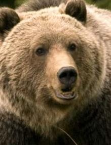
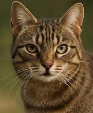
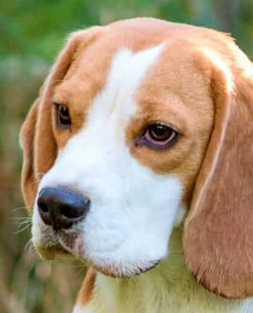
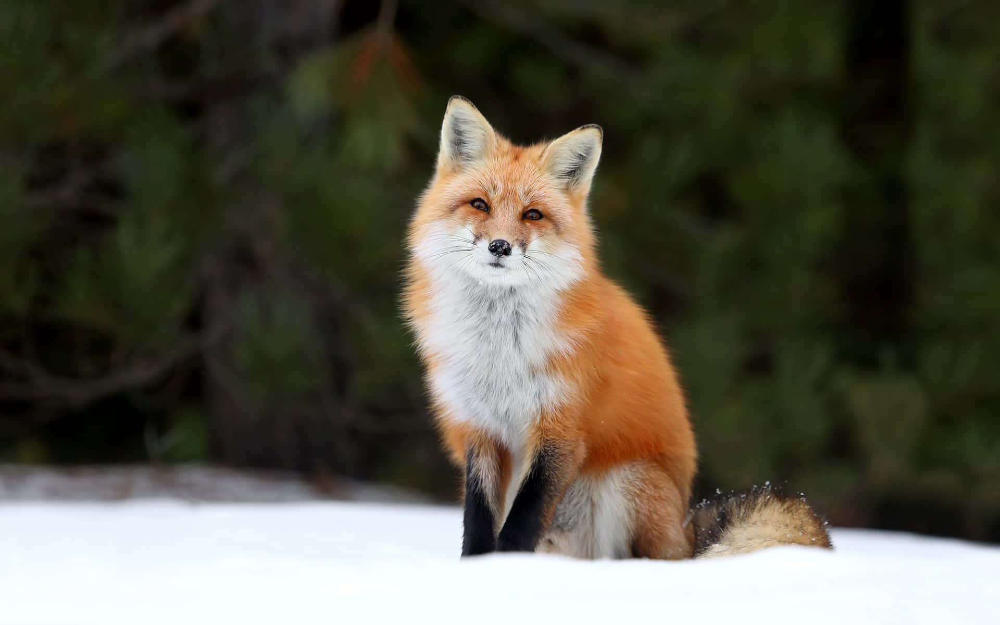
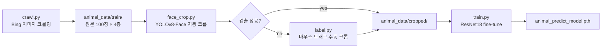
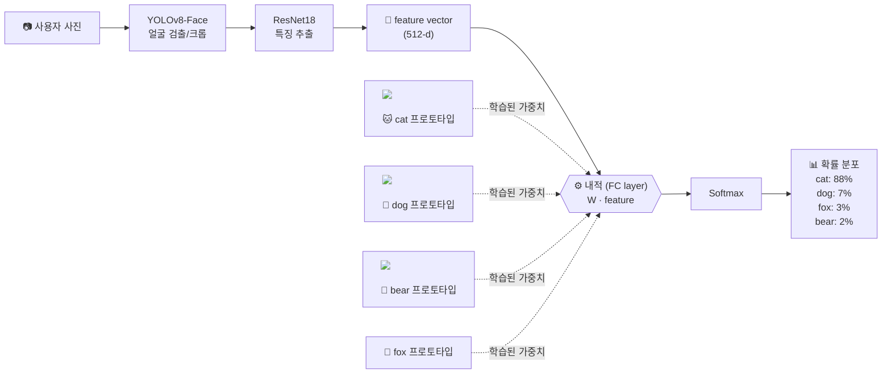

# Animal_AI

당신은 어떤 **동물상**? 사람 얼굴 사진을 넣으면 **bear / cat / dog / fox** 4종 동물 얼굴과 가장 닮은 정도를 확률로 돌려주는 분류 모델 + REST API.

---

## 동물상 카테고리

| 🐻 bear | 🐱 cat | 🐶 dog | 🦊 fox |
|:---:|:---:|:---:|:---:|
|  |  |  |  |

> 학습 데이터는 Bing 이미지 크롤링 → YOLOv8-Face로 얼굴 영역 크롭 → 수동 보정의 3단계로 구축됨.

---

## 학습 파이프라인



---

## 추론 파이프라인



### 동작 원리
1. **얼굴 크롭**: 사용자 사진에서 YOLOv8-Face로 얼굴 영역만 추출 (배경 노이즈 제거)
2. **특징 추출**: ResNet18 backbone이 얼굴을 512차원 feature vector로 인코딩
3. **내적 비교**: 마지막 FC layer의 가중치 행렬 $W \in \mathbb{R}^{4 \times 512}$의 각 행은 학습 중 형성된 **"동물상 프로토타입"**. feature vector와 각 프로토타입 행의 **내적**(dot product)이 곧 logit
4. **확률 변환**: Softmax를 통해 4종에 대한 확률 분포로 변환

> 즉, "사용자 얼굴 ↔ 동물 얼굴 평균 표상"의 코사인 유사도와 본질적으로 동일한 비교를 학습된 가중치로 수행.

---

## 프로젝트 구조

```
Animal_AI/
├── crawl.py             # Bing 이미지 크롤러
├── face_crop.py         # YOLOv8-Face 자동 크롭
├── label.py             # 수동 크롭 GUI (cv2.selectROI)
├── train.py             # ResNet18 학습
├── inference.py         # CLI 추론
├── api.py               # FastAPI 서버
├── requirements.txt
└── animal_data/
    ├── train/           # 원본 (Bing 크롤 결과)
    └── cropped/         # 얼굴만 크롭 (학습용)
```

### 실행 순서

```bash
# 0. 의존성 설치
pip install -r requirements.txt

# 1. 데이터 수집 (각 클래스 100장)
python crawl.py

# 2. 얼굴 자동 크롭
python face_crop.py

# 3. 자동 크롭 실패한 이미지 수동 보정 (특히 fox)
python label.py

# 4. 학습
python train.py

# 5. 추론 (CLI)
python inference.py path/to/your_face.jpg

# 5'. API 서버 띄우기
uvicorn api:app --host 0.0.0.0 --port 8000
```

---

# Animal Face API

동물상 분류 REST API. 이미지를 업로드하면 bear / cat / dog / fox 중 하나를 예측합니다.

## Base URL

```
http://<서버주소>:8000
```

---

## Endpoints

### `POST /predict`

이미지 URL을 전달하여 동물상을 예측합니다.

**Request**

| 항목 | 내용 |
|------|------|
| Method | POST |
| Content-Type | application/json |
| Body | `image_url` — 이미지 URL (string) |

**Example**

```bash
curl -X POST http://localhost:8000/predict \
  -H "Content-Type: application/json" \
  -d '{"image_url": "https://example.com/image.jpg"}'
```

**Response `200 OK`**

```json
{
  "face_detected": true,
  "similarities": {
    "CAT": 88.0,
    "DOG": 7.0,
    "FOX": 3.0,
    "BEAR": 2.0
  }
}
```

| 필드 | 타입 | 설명 |
|------|------|------|
| `face_detected` | bool | 얼굴 검출 성공 여부. `false`면 원본 이미지로 fallback |
| `similarities` | object | 각 클래스별 유사도 (0~100) |

**Response `400 Bad Request`**

```json
{
  "detail": "이미지 URL을 가져올 수 없습니다."
}
```

---

### `GET /health`

서버 상태를 확인합니다.

**Example**

```bash
curl http://localhost:8000/health
```

**Response `200 OK`**

```json
{
  "status": "ok"
}
```
